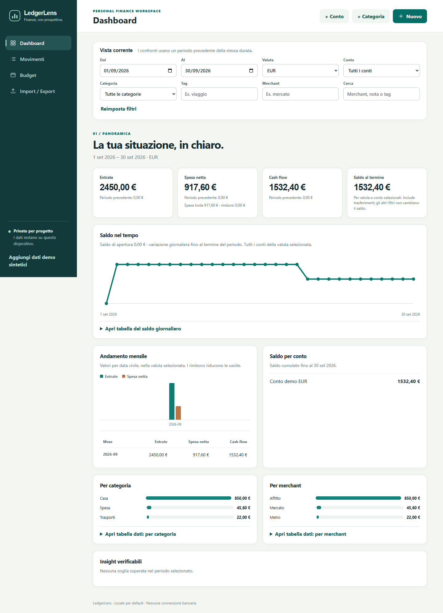
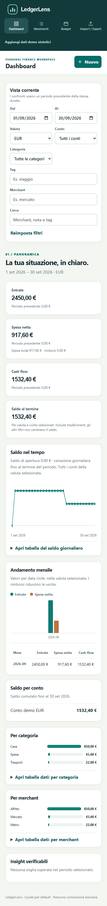
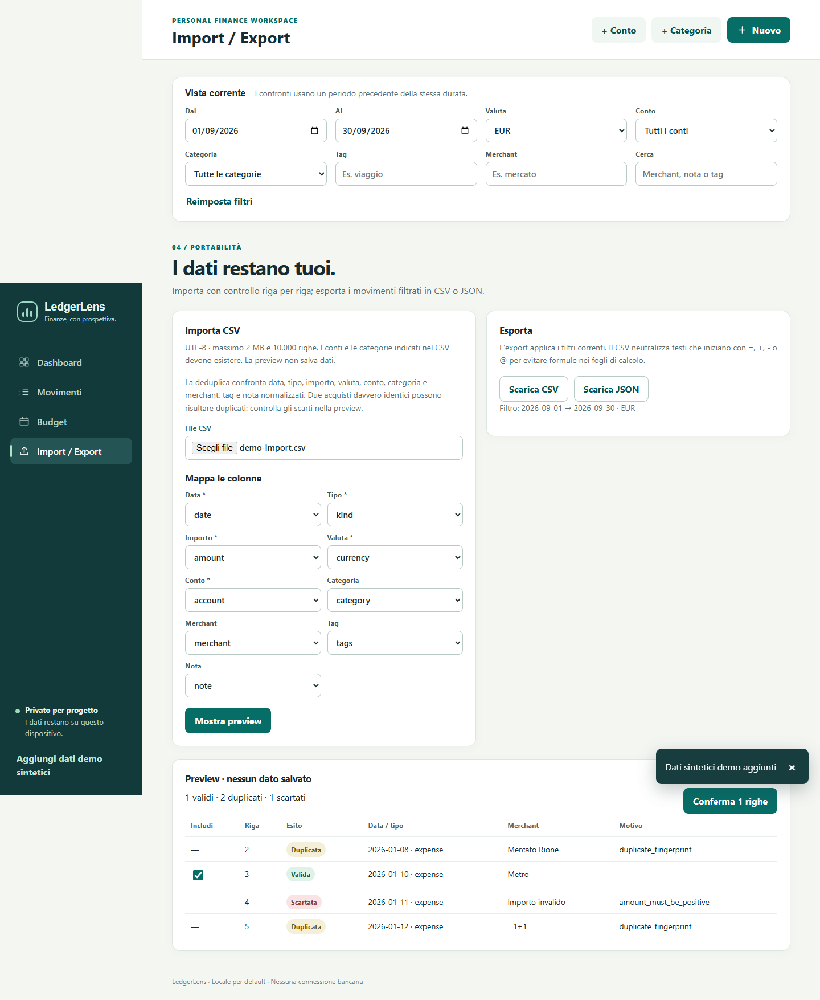
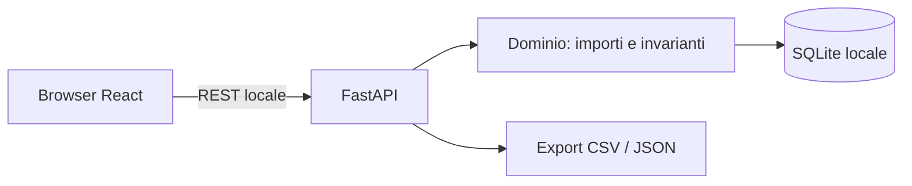

# SpendFlow

**Expense tracker privacy-first, local-first e utilizzabile.** SpendFlow rende leggibili le spese senza inviare transazioni a servizi terzi. Rimborsi, trasferimenti e valute restano distinti nel modello e nei report, così un numero in dashboard ha un significato verificabile.







## Funzioni

- Entrate, uscite, rimborsi collegati a una spesa e trasferimenti atomici fra conti; modifica, cancellazione confermata e ripristino.
- Budget mensili per categoria con consuntivo netto; KPI, cash-flow, saldo nel tempo, trend mensili e breakdown categoria/merchant. Ogni grafico ha dati tabellari equivalenti.
- Filtri combinabili per date, valuta, conto, categoria, tag, merchant e ricerca testuale; confronto con periodo precedente della stessa durata.
- Import CSV con mapping, preview, validazione per riga, deduplica, selezione parziale e report scarti. Export CSV e JSON filtrati.
- Demo additiva con soli dati sintetici etichettati. Nessuna connessione bancaria o telemetria.

## Stack e flusso

Python 3.12, FastAPI, Pydantic, SQLAlchemy 2, Alembic, SQLite; React, TypeScript, Vite. Test: Pytest, Hypothesis, Vitest e Playwright. Qualità: Ruff, mypy strict, ESLint, Prettier, pre-commit e GitHub Actions.



## Avvio locale

Prerequisiti: Python 3.12, Node.js 20+, npm. I comandi seguenti partono dalla root del repository. L'API usa `127.0.0.1:8000`; Vite usa `127.0.0.1:5173` e inoltra `/api`. Apri `http://127.0.0.1:5173`.

**Windows PowerShell** — in due terminali:

```powershell
cd backend
py -3.12 -m venv .venv
.\.venv\Scripts\python.exe -m pip install -e '.[dev]'
.\.venv\Scripts\alembic.exe upgrade head
.\.venv\Scripts\uvicorn.exe ledgerlens.api:app --host 127.0.0.1 --port 8000
```

```powershell
cd frontend
npm ci
npm run dev -- --host 127.0.0.1
```

**macOS/Linux** — in due terminali:

```bash
cd backend
python3.12 -m venv .venv
.venv/bin/python -m pip install -e '.[dev]'
.venv/bin/alembic upgrade head
.venv/bin/uvicorn ledgerlens.api:app --host 127.0.0.1 --port 8000
```

```bash
cd frontend
npm ci
npm run dev -- --host 127.0.0.1
```

Avvio alternativo con Docker Compose, se Docker è disponibile: `docker compose up --build`. Le porte sono pubblicate solo su loopback e il DB usa un volume locale. Per iniziare, premi **Carica demo** nell'app: aggiunge dati sintetici senza eliminare quelli presenti. La fixture [`fixtures/demo-import.csv`](fixtures/demo-import.csv) include righe valide e uno scarto intenzionale per provare la preview.

La documentazione OpenAPI è su `http://127.0.0.1:8000/docs`. `.env.example` elenca le variabili; non contiene segreti.

## Verifica

Con le dipendenze installate:

```powershell
cd backend
.\.venv\Scripts\ruff.exe check ledgerlens tests alembic
.\.venv\Scripts\ruff.exe format --check ledgerlens tests alembic
.\.venv\Scripts\mypy.exe --strict ledgerlens
.\.venv\Scripts\python.exe -m pytest -q
.\.venv\Scripts\alembic.exe upgrade head
```

```powershell
cd frontend
npm run lint
npm run format:check
npm run typecheck
npm run test
npm run build
npm run test:e2e
```

`npm run test:e2e` richiede API e Vite avviati come sopra e un browser Chromium Playwright installato (`npx playwright install chromium`). Su macOS/Linux sostituisci `.\.venv\Scripts\` con `.venv/bin/`. La verifica Playwright e le evidenze effettive sono in [`docs/verification.md`](docs/verification.md). I pre-commit hook richiedono venv Python attivo e `npm ci` già eseguito.

## Schema e scelte sul denaro

Quattro tabelle principali: `accounts`, `categories`, `transactions`, `budgets`. I trasferimenti sono due righe collegate e i rimborsi possono riferirsi alla spesa originale. Le categorie si archiviano senza cancellare lo storico. Dettagli in [`docs/data-model.md`](docs/data-model.md) e [`docs/architecture.md`](docs/architecture.md).

Ogni transazione salva `amount_minor > 0` e codice ISO 4217; `kind` e direzione stabiliscono il segno. Una funzione centralizzata converte da `Decimal` con `ROUND_HALF_UP` dichiarato e rifiuta precisione non supportata. EUR, USD e GBP hanno due cifre minori; JPY zero. Non si usano float per denaro e non si convertono valute. I report richiedono una valuta: sommare EUR e USD non produrrebbe un valore attendibile. Le date sono civili, i budget mensili senza prorating.

## Sicurezza e compromessi

I dati restano in SQLite locale, escluso da Git; SQLite non è cifrato. Import limitato a 2 MiB e 10.000 righe UTF-8, preview senza scritture, conferma vincolata al digest, scarti per riga. Il CSV esportato neutralizza i valori testuali che possono diventare formule nei fogli elettronici; JSON mantiene gli originali. Vedi [`docs/security.md`](docs/security.md).

La deduplica considera identici due acquisti con stessi campi normalizzati, anche se nella realtà fossero due acquisti distinti. I saldi iniziali sono zero. I campi CSV con newline incorporato non sono supportati. Non ci sono sync, login, tassi di cambio, connessioni bancarie né ricorrenze.

## Roadmap

Import di formati bancari con profili di mapping salvati localmente; saldi iniziali espliciti; backup locale guidato; maggiore copertura di accessibilità e lingue. Ogni nuova valuta richiede esponente verificato e test specifici.

## Portfolio

Il [case study](docs/portfolio-case-study.md), la [bozza del post LinkedIn](docs/linkedin-post.md) e una [breve descrizione GitHub](docs/github-description.md) sono pronti per revisione. Nessun badge CI è mostrato prima di un repository remoto configurato.

Licenza: [MIT](LICENSE).
