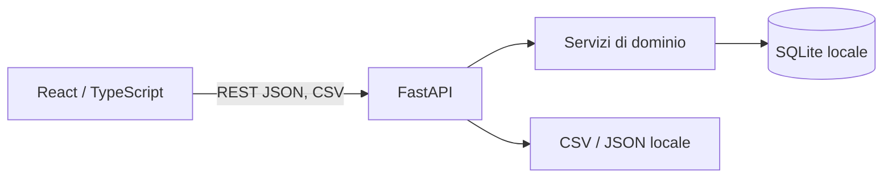

# LedgerLens — architettura e decisioni

LedgerLens è un monolite locale: React/Vite chiama una API FastAPI sul loopback; SQLAlchemy 2 e Alembic gestiscono SQLite. Nessun servizio terzo riceve dati. Il backend usa tipi e vincoli compatibili con PostgreSQL, pur usando SQLite nella demo.

## ADR 001 — denaro e date

`amount_minor` è intero strettamente positivo; `kind` indica `income`, `expense`, `refund` o `transfer`. La conversione centralizzata da `Decimal` usa `ROUND_HALF_UP`; la precisione superiore alle cifre minori della valuta è rifiutata, così nessun arrotondamento nascosto altera una transazione. EUR, USD, GBP: 2 cifre; JPY: 0. Nessun float e nessuna conversione fra valute. Ogni conto ha una valuta; transazione e conto devono coincidere. Si salva la data civile, senza fuso; i mesi sono intervalli semichiusi dal primo giorno al primo del mese successivo.

## ADR 002 — rimborsi, trasferimenti e budget

Un rimborso aumenta il saldo del conto e riduce la spesa netta, senza diventare entrata. Se collegato a una spesa, ne eredita la categoria e la somma dei rimborsi collegati non può superare la spesa. Un rimborso senza collegamento ha una categoria esplicita ed è indicato come tale. Un trasferimento crea due movimenti collegati, stesso importo, valuta e data, conti distinti, in una transazione DB. Influisce sui saldi dei conti ma non su cash-flow, entrate, uscite, budget o breakdown. I budget sono unici per categoria, mese civile e valuta; il consuntivo è la spesa netta del mese, senza prorating. Le categorie si archiviano: lo storico conserva i riferimenti.

## ADR 003 — analisi e filtri

KPI, grafici e tabelle operano su una valuta selezionata. Filtri combinabili: data iniziale/finale inclusive, conto, categoria, tag, merchant e ricerca testuale. Confronto: periodo immediatamente precedente con lo stesso numero di giorni, anche quando un mese solare ha durata diversa dal precedente. Questa regola unica evita confronti di durata diseguale. Se la base è zero non si mostra una percentuale. I grafici hanno sempre tabella equivalente e legenda testuale. Il saldo nel tempo include trasferimenti, il cash-flow no. Gli insight dichiarano soglia e dati di origine.

## ADR 004 — import ed export

Preview CSV senza scritture, massimo 2 MiB e 10.000 righe, UTF-8 con BOM facoltativo. Mapping esplicito; ogni riga mostra validità, duplicato o scarto. Conferma con stesso SHA-256, mapping e selezione intenzionale delle righe valide; un'unica transazione DB. Impronta deterministica dei campi normalizzati, vincolo unico DB: due acquisti identici possono essere considerati duplicati, limite dichiarato nella UI. Export CSV neutralizza con apostrofo i testi che iniziano, anche dopo spazi, con `=`, `+`, `-`, `@`; JSON preserva i testi originali. Le righe CSV con newline incorporato tra virgolette non sono supportate e vengono scartate.

## ADR 005 — privacy e recupero

API vincolata a `127.0.0.1` per default, Origin configurato, nessuna telemetria, log senza payload finanziari, file SQLite escluso da Git. La cancellazione dei movimenti è reversibile per sessione tramite endpoint restore e UI undo. La modalità demo aggiunge solo dati sintetici etichettati e usa identificatori stabili per non duplicarli.

## Assunzioni e limiti

Uso individuale su computer fidato; nessun login simulato. SQLite non è cifrato. Non ci sono tassi di cambio, sincronizzazione, connessioni bancarie né ricorrenze. I saldi iniziali sono zero; un saldo reale richiede registrare movimenti di apertura come entrate. La deduplica non distingue due acquisti identici nello stesso giorno con gli stessi dettagli.
